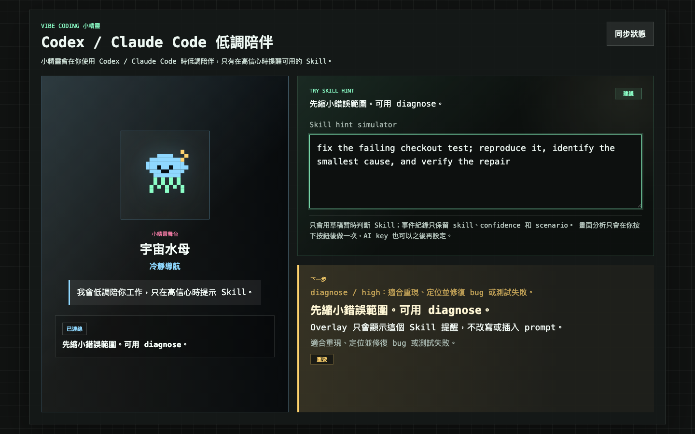

# Vibe Coding Companion

一個以隱私優先為原則的本機 coding companion：它把 Codex／Claude Code 的事件轉成低干擾的像素精靈狀態，只在訊號足夠明確時提示下一步或適合的 Skill。

## Executive Summary

Vibe Coding Companion observes local coding events and turns them into a quiet work-state companion. Its deterministic Skill recommendation maps observable signals, such as edits and test results, to one suggested next action. High-confidence recommendations may speak through the overlay, while lower-confidence recommendations remain visible in the Console without interrupting the coding surface. This is a Human-in-the-loop workflow: Vibe proposes, but the developer decides whether to act, and no Skill is executed or installed automatically.

**Demo:** [Watch the synthetic local recommendation demo](docs/demo/skill-recommendation.webm). This WebM is synthetic local evidence captured from the real browser flow; it contains no user prompt or private Skill metadata.



## 作品集重點

- **跨介面產品切片**：Web Console、local event server、macOS foreground probe 與 Electron overlay。
- **低干擾互動模型**：reading、coding、testing、error、success 等狀態映射到邊緣動態，不遮住主要工作區。
- **本機優先**：prompt advice 採 deterministic rules；AI 與 Vision 都是選用且需使用者主動設定或觸發。
- **隱私工程**：不把 API key 寫進 repository，不保存原始 prompt，不持續截圖。
- **測試保護**：unit、integration、desktop placement 與 Playwright E2E 覆蓋核心工作流程。

## 架構摘要

```text
src/agent-* / event-*     agent 事件正規化與本機事件流
src/companion-*           工作摘要、brain、建議與角色行為
src/overlay-*             Electron 視窗、狀態與避讓定位
src/prompt-* / vision-*   本機 prompt advisor 與 opt-in Vision
scripts/                  launcher、event server、hook 與 prompt watcher
tests/ + e2e/             行為測試與瀏覽器流程
```

## 快速 Demo

```bash
npm ci
npm run dev
```

開啟 `http://127.0.0.1:5173/`，在 Skill hint simulator 輸入一個具體除錯需求，觀察 companion 只在信心足夠時提出一個建議。完整本機事件橋接使用 `npm run dev:all`；桌面 overlay 再另開 `npm run overlay`。

## 安全與隱私

- Google AI Studio key 僅寫入使用者家目錄的 `~/.vibe-coding-companion.env`，權限為 `0600`。
- Prompt watcher 只在指定 coding app 位於前景時讀取目前輸入，事件流不保存原始 prompt。
- Vision context 只在使用者按下按鈕後擷取一次；無效圖片不持久化，也不會背景連續監看。
- 本機 log、測試輸出、環境檔與 runtime artifacts 均由 `.gitignore` 排除。

### 本機服務的安全邊界

- Event server 只監聽 loopback，不對區域網路或網際網路開放。
- 所有 HTTP 請求都驗證 `Host`，只接受 `127.0.0.1`、`localhost` 與 `::1`，避免 DNS rebinding 繞過本機限制。
- 瀏覽器請求只接受明確列入允許清單的 Vite 來源，CORS 會回傳精確來源，不使用萬用字元。
- CLI、hooks 與 Electron overlay 等非瀏覽器 loopback client 不需要偽造 `Origin`，既有事件流程維持不變。
- API key 與原始 prompt 不會寫入 event log；設定狀態只回傳是否已設定，不回傳 key。

## Run

```bash
npm install
npm run dev
```

Open `http://127.0.0.1:5173/` for the Companion Dashboard.
The older web prototype playground is still available at
`http://127.0.0.1:5173/demo.html`.

To run the companion with the local event endpoint:

```bash
npm run dev:all
```

This starts:

- Web app: `http://127.0.0.1:5173/`
- Event endpoint: `http://127.0.0.1:5174/events`

To show the sprite above Codex or Terminal as a desktop overlay, keep
`npm run dev:all` running and start:

```bash
npm run overlay
```

For daily use without extra Terminal windows, use the companion launcher:

```bash
npm run companion:setup-key
npm run companion:start
npm run companion:stop
```

`companion:setup-key` starts the background services and opens
`http://127.0.0.1:5173/setup-key.html`, a local-only setup page with a password
input for the Google AI Studio key. The page posts to the local event server and
saves Google AI Studio settings to `~/.vibe-coding-companion.env` with `0600`
permissions. It does not print the key to the terminal and does not write it
into this repo. `companion:start` launches the web app, local event server, and
Electron overlay as detached background services with logs under
`artifacts/companion-*.log`. It also launches a prompt watcher that reads the
focused macOS text input only when the foreground app is Codex or Claude Code,
then sends settled `prompt:draft` events to the local event server.
It stops any previously recorded companion services first so repeated starts do
not create duplicate hidden processes.

The same setup page is also the local Companion Console. It shows:

- Server status.
- Whether AI is configured, without showing the API key.
- Current model.
- A Session summary block that turns recent local events into a short
  work-state readout, including phase and evidence signals such as reads, edits,
  and failed or passed tests.
- A smoke-test button that sends a failed-test event and displays the latest AI
  decision from the local event stream.
- A one-shot Vision context button that captures a user-approved screen frame,
  asks the configured AI provider for a coding-workflow summary, and displays
  the result in the Console. A valid Vision result is also published as an
  `ai:decision` event with a placement safe zone so the desktop overlay can
  react through the same event stream as hook-based agent events.
- A Skill hint line that recommends one useful Codex skill for the current
  activity, such as `diagnose` for failing tests or `frontend-design` for UI
  work.
- A Next step card that upgrades the Skill hint into a concrete action,
  priority, and reason. For example, repeated failed tests become a focused
  `diagnose` recommendation instead of a generic skill label. Each advice also
  includes `speakable`, which decides whether the desktop sprite should say it
  out loud or keep it inside the Console.
- A Prompt Coach textarea that emits local `prompt:draft` events while you type
  and renders prompt-quality advice through the same Skill hint and Next step
  panels as the desktop sprite.
- Overlay calibration controls for idle size, active size, wandering speed,
  safe margin, and preferred side (`auto`, `left`, or `right`). These save to
  `~/.vibe-coding-companion.overlay.json` and are polled by both the Electron
  window placement logic and the overlay renderer.
- A local Placement diagnostic panel that asks the companion server for the
  current foreground app, Accessibility status, no-fly region count, placement
  mode, and chosen sprite bounds. It previews the currently selected preferred
  side without saving first. This stays in the Console and is not rendered in
  the desktop overlay.

The overlay is a transparent, always-on-top Electron window. It is click-through
so Codex or Claude Code still receives mouse clicks, text selection, and scrolls.
It uses a tiny wandering sprite for `idle` and `waiting`, with subtle
micro-actions such as blinking, edge-peeking, looking around, and a small wave.
Progress bars, resize sliders, and status chips stay out of the desktop overlay
so it does not compete with Codex content. The desktop overlay can show one
compact speech bubble for high-value AI decisions, Skill hints, or Next-step
advice, such as `用 diagnose：重現最小失敗案例。`, and hides it again when the
companion returns to quiet states. Low-priority advice stays inside the Console
instead of opening a bubble on top of the coding surface.

The overlay watches the macOS foreground app and automatically hides unless the
active app looks like Codex or Claude Code. It shows for:

- Codex or Claude as the foreground app.
- Terminal/iTerm/Warp/Ghostty/WezTerm windows whose title includes `codex` or
  `claude`.
- VS Code/Cursor/Windsurf windows whose title includes `codex` or `claude`.

If macOS asks for Accessibility permission for Terminal or Electron, allow it so
the overlay can read the foreground app and window title. The prompt watcher may
also need Accessibility permission for the shell process running
`scripts/watch-prompt.js`; without that permission, typing-time prompt advice is
silent while the rest of the companion keeps working. Some Electron apps do not
expose their prompt input as an Accessibility text field. In that case, the
watcher cannot safely read the existing app input box; use the Companion
Console's Prompt Coach textarea for reliable typing-time advice.

When the foreground app reports window bounds, the overlay keeps the sprite
window inside the detected Codex/Claude window instead of floating across the
whole desktop. While idle or waiting, the small sprite slides along a
reader-safe edge rail instead of crossing the central text area. It parks for
an attention interval, then makes a brief hop to the next edge position instead
of drifting continuously. Active work states interrupt the park and move the
compact sprite up or down that edge rail for reading, coding, testing, error,
and success reactions. Error and success are short-lived reactions; the overlay
settles back to `waiting` after the attention moment.
For active work, the Electron presence controller also infers no-fly regions
from the foreground Codex/Claude window: central reading content, the bottom
input composer, and the right-side panel. The bounds resolver keeps the
preferred state-aware placement when it is clear; if that would cover a no-fly
region, it chooses a lower-overlap edge slot instead. On macOS, the foreground
probe also attempts a lightweight Accessibility scan of the active window and
adds reported text areas, scroll areas, web areas, and right-side groups to the
same no-fly model. If Accessibility permission is unavailable or a window does
not expose useful UI regions, the overlay falls back to the geometry model. This
placement assist does not continuously capture screenshots and does not send the
screen to an AI provider.
When Vision context supplies a `safeZone`, active reactions can dock to
`right-edge`, `top-right`, or `bottom-right`; if no clear safe placement exists,
`retreat` shrinks the sprite into a quiet top-right position.
The local overlay calibration can also bias active placement to `left` or
`right`. The bias is a preference, not a hard constraint: no-fly regions can
still push the sprite to the other side when the preferred side would cover
important UI.

The main overlay runtime also tracks local agent events and moves the sprite
between state-aware zones:

- `reading` -> upper edge rail.
- `coding` -> middle edge rail.
- `testing` -> lower edge rail, above the input area.
- `error` -> top alert edge rail.
- `success` -> celebration edge rail.
- `idle` and `waiting` -> tiny wandering sprite along the edge rail.
- `thinking` -> compact companion zone.

The overlay animation model uses focus-safe companion intentions:

- `waiting` -> mostly `edge-peek`, with rare blink/look moments.
- `coding` -> `work-buddy`, a small observing/typing companion pose.
- `testing` -> `test-watch`, a downward waiting-for-results pose.
- `error` -> `quick-startle`, a brief reaction that does not loop forever.
- `success` -> `tiny-celebrate`, a compact celebration before returning to quiet.

This first version uses hook/event signals and opt-in Vision context checks as
live sprite state sources. The Console can run a one-shot AI Vision context
check after explicit user approval, publish the resulting `suggestedState` as an
overlay decision, and then the sprite reacts on the next event poll. It does not
continuously watch the screen.
Typing-time prompt advice uses a local deterministic advisor instead of calling
the configured AI provider on every draft. The Prompt Coach textarea and optional
watcher both post drafts to `POST /events` as `{ "type": "prompt:draft",
"prompt": "..." }`; the server turns each actionable draft into a short
`ai:decision` with `nextStepAdvice` and does not persist the raw prompt text in
the event stream. The event server scans installed Codex skills from
`~/.codex/skills` and plugin skill caches, reads each `SKILL.md` frontmatter
`name` and `description`, and uses that metadata when ranking Skill hints.
Drafts shorter than the configured minimum are ignored. To run the watcher by
itself for debugging:

```bash
npm run watch:prompt
```

Useful tuning environment variables:

- `PROMPT_WATCH_INTERVAL_MS` controls how often the focused text input is polled
  (`1200` by default).
- `PROMPT_DRAFT_SETTLE_MS` controls how long the draft must stop changing before
  advice is emitted (`500` by default).
- `PROMPT_DRAFT_MIN_CHARS` controls the minimum prompt length before advice is
  considered (`18` by default).

The Console also derives a conservative Skill recommendation from the same
summary/event metadata. The recommendation is advisory only; it does not execute
or install skills automatically.
The Next-step advice playbook currently covers:

- Repeated failed tests -> use `diagnose` to shrink the failing case.
- Several edits without test feedback -> run one minimal TDD test.
- Failed tests recovering to passed -> inspect the diff and choose commit or the
  next small slice.
- UI, CSS, animation, or overlay work -> use `frontend-design` and screenshot
  verification.
- Waiting state -> summarize the current state and choose the next step.

Companion Brain v1 turns those events into a small behavior packet with speech,
gesture, priority, and TTL. Repeated speech is cooled down so the sprite feels
responsive without talking over the work. When an `ai:decision` includes
`nextStepAdvice`, the brain prioritizes that concrete action over a generic
Skill hint and compresses it into one short bubble line only when `speakable` is
true.
Work Context keeps a small rolling view of recent events. Repeated failed tests
become high-friction `debugging` work and can trigger a focused `diagnose`
suggestion even before an AI decision arrives; repeated edits stay low-friction
`coding` work so the sprite quietly follows instead of speaking on every file
change.

Optional AI reactions can refine those hook/event signals into smarter sprite
states. For Google AI Studio Gemma, set `GEMINI_API_KEY` before starting
`npm run dev:all`; the default model is `gemma-4-31b-it`. You can also set
`AI_PROVIDER=google`, `AI_API_KEY`, and `AI_MODEL` explicitly. Without an API
key, the companion falls back to the deterministic event rules and never calls
an AI provider.

The Vision context endpoint is `POST /vision/context` with `{ "imageDataUrl":
"data:image/png;base64,..." }`. It returns a privacy-filtered summary shape:
`activity`, `suggestedState`, `confidence`, `visibleSignals`, and optional
`safeZone`. Valid safe zones are `right-edge`, `top-right`, `bottom-right`, and
`retreat`. When that summary has a valid `suggestedState`, the server appends an
`ai:decision` event for overlay pollers. Invalid or unsupported images return
`null` instead of persisting the image. If the AI provider responds with text
that cannot be structured after a repair pass, the endpoint returns a
low-confidence `waiting` context so the overlay stays in a safe idle reaction.

## Test

```bash
npm run verify
```

This is the local quality gate. It runs both:

```bash
npm test
npm run test:e2e
```

The E2E runtime uses isolated ports `5183` and `5184`, so it does not attach to
an already-running daily companion service on `5173` or `5174`.

To run the real provider boundary test for the optional AI classifier:

```bash
RUN_AI_CONTRACT_TEST=1 GEMINI_API_KEY=... npm test -- tests/ai-companion-classifier.contract.test.js
```

Development follows TDD. Add one failing behavior test, make it pass with the
smallest implementation, then refactor while tests stay green.

The E2E suite also attaches desktop and compact viewport screenshots and checks
that the Canvas character is not blank.

## MVP Scope

- Vanilla web app prototype.
- Canvas pixel blob character.
- Calm, Snark, and Showcase modes.
- Simulated bug-fix flow ending in waiting, with replay.
- Vibe Meter, status light, one-line English status copy.
- Character size and position preferences stored in localStorage.
- Expanded debug controls for development.
- Transparent desktop overlay for placing the sprite above Codex or Terminal.

## Demo Script

1. Open `http://127.0.0.1:5173/`.
2. Point out the fake coding-agent background and the companion overlay.
3. Press `開始`.
4. Watch the state line and blob move through bug-fix states:
   `thinking -> reading -> coding -> testing -> error -> debugging -> testing -> success -> waiting`.
5. Switch between `Calm`, `Snark`, and `Showcase`.
6. Drag the blob to a new position.
7. Change `角色大小`.
8. In `事件橋接`, press `測試失敗` or `測試通過` to drive the companion with
   adapter-style events.
9. Press `重播` to run the flow again.

## Event Adapter

The prototype exposes a small event adapter through the mounted app instance:

```js
const companion = mountApp(document.querySelector("#app"));

companion.sendEvent({ type: "prompt:submitted" }); // thinking
companion.sendEvent({ type: "tool:start", tool: "read" }); // reading
companion.sendEvent({ type: "tool:start", tool: "edit" }); // coding
companion.sendEvent({ type: "tool:start", tool: "test" }); // testing
companion.sendEvent({ type: "tool:finish", tool: "test", status: "failed" }); // error
companion.sendEvent({ type: "tool:start", tool: "debug" }); // debugging
companion.sendEvent({ type: "tool:finish", tool: "test", status: "passed" }); // success
companion.sendEvent({ type: "turn:complete" }); // waiting
```

This is the future integration point for Codex pets, Claude hooks, or another
agent event source. It only accepts observable lifecycle events; it does not
display hidden model reasoning.

The `事件橋接` controls inside the debug panel are a manual playground for this
adapter. They simulate the same event objects without requiring a real Codex or
Claude integration.

## Local Event Endpoint

When `npm run dev:all` is running, external tools can drive the companion by
posting events to the local endpoint:

```bash
npm run emit:event -- test-failed
npm run emit:event -- test-passed
npm run emit:event -- read
npm run emit:event -- edit
npm run emit:event -- complete
```

The browser polls `GET /events?since=<cursor>` and passes each event into
`companion.sendEvent(event)`.

`DELETE /events` clears captured events for isolated tests or manual demos, but
event ids remain monotonic while the server process is alive so active overlay
pollers do not miss newly posted events.

`GET /session/summary` returns the current local session summary derived from
the same captured event stream. It does not call an AI provider; it summarizes
recent observable events into `title`, `phase`, `summary`, `signals`, and
`confidence` for the Companion Console.

## Hook Adapter Spike

The prototype can also normalize Claude Code or Codex-like hook payloads into
the same companion events:

```bash
npm run emit:hook -- claude-code fixtures/claude-code/test-failed.json
cat fixtures/claude-code/test-failed.json | npm run emit:hook -- claude-code -
```

Current mappings:

- `UserPromptSubmit` -> `prompt:submitted`
- `PreToolUse` with read/search tools -> `tool:start read`
- `PreToolUse` with edit/write/patch tools -> `tool:start edit`
- `PreToolUse` with test commands -> `tool:start test`
- `PostToolUse` test commands with exit code `0` -> `tool:finish test passed`
- `PostToolUse` test commands with non-zero exit code -> `tool:finish test failed`
- `PostToolUseFailure` test commands -> `tool:finish test failed`
- `Stop` -> `turn:complete`

The adapter is intentionally conservative. Unknown hook payloads are ignored
instead of being guessed into a misleading companion state.

To capture real hook payloads while testing a live agent session, set
`HOOK_CAPTURE_FILE` before starting the agent:

```bash
HOOK_CAPTURE_FILE="$PWD/artifacts/hook-payloads/live.jsonl" npm run emit:hook -- codex -
```

Hook configs inherit this support because they call `scripts/emit-hook.js`.
Each captured JSONL row stores the provider, raw payload, and normalized
companion event.

## Connect Real Agent Hooks

Start the web app and event endpoint:

```bash
npm run dev:all
```

Install a project-local hook config for the agent you want to test:

```bash
npm run setup:hooks -- claude-code
npm run setup:hooks -- codex
```

Or launch an interactive live-capture session directly:

```bash
npm run live:codex
npm run live:claude
```

These live commands ensure the hook config exists, set `HOOK_CAPTURE_FILE`, and
start the selected agent. Use `npm run live:codex -- --print` to inspect the
launch plan without starting Codex.

If `codex` is not on your shell `PATH`, point the launcher at the Codex app
binary:

```bash
CODEX_BIN=/Applications/Codex.app/Contents/Resources/codex npm run live:codex
```

The setup command copies tested examples from `hooks/`:

- Claude Code -> `.claude/settings.local.json`
- Codex -> `.codex/hooks.json`

It refuses to overwrite an existing hook config. Edit or move the existing file
manually if you already have project hooks.

After setup:

1. Open the agent in this repo.
2. Run `/hooks`.
3. Confirm the Claude Code hooks or trust the Codex project-local hooks.
4. Ask the agent to read, edit, or run tests.
5. Keep `npm run dev:all` running so the companion can receive events.

For a live Codex smoke test, run:

```bash
npm run live:codex
```

Then, inside the launched Codex session, run `/hooks`, trust the project hooks,
and ask Codex to do a small observable workflow such as:

```text
Read package.json, make a tiny harmless edit, run npm test, then summarize.
```

Expected companion behavior:

- Prompt submit -> `thinking`.
- Read or grep tool -> `reading`.
- Edit, write, multiedit, or apply patch tool -> `coding`.
- Test command starts -> `testing`.
- Test output with failed/failure/exit code non-zero -> `error`.
- Test output with passed and no failure signal -> `success`.
- Stop hook -> `waiting`.

Codex note: project-local hooks load only after the project `.codex/` layer is
trusted. In this Codex CLI version, a non-interactive `codex exec` smoke run used
`command_execution` and did not trigger the configured command hooks; use the
interactive `/hooks` trust flow for the live session check.

Reference docs:

- Claude Code hooks: https://code.claude.com/docs/en/hooks
- Codex hooks: https://developers.openai.com/codex/hooks
